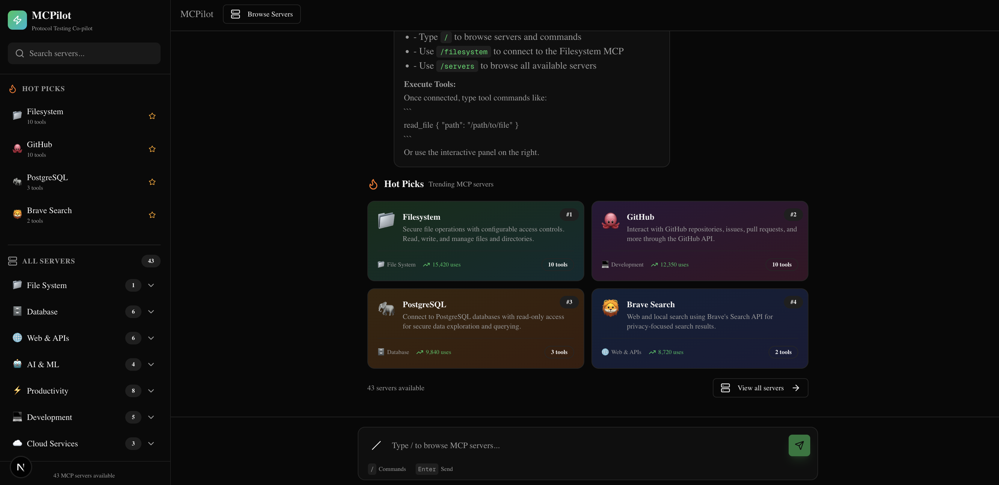
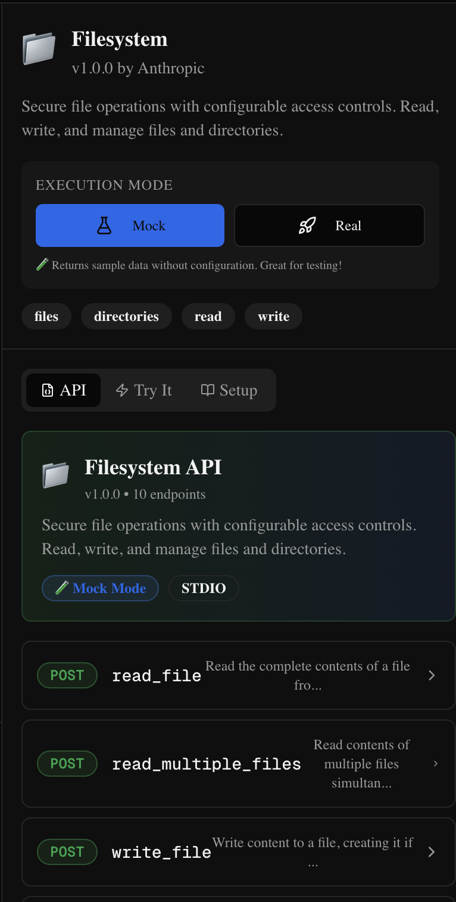
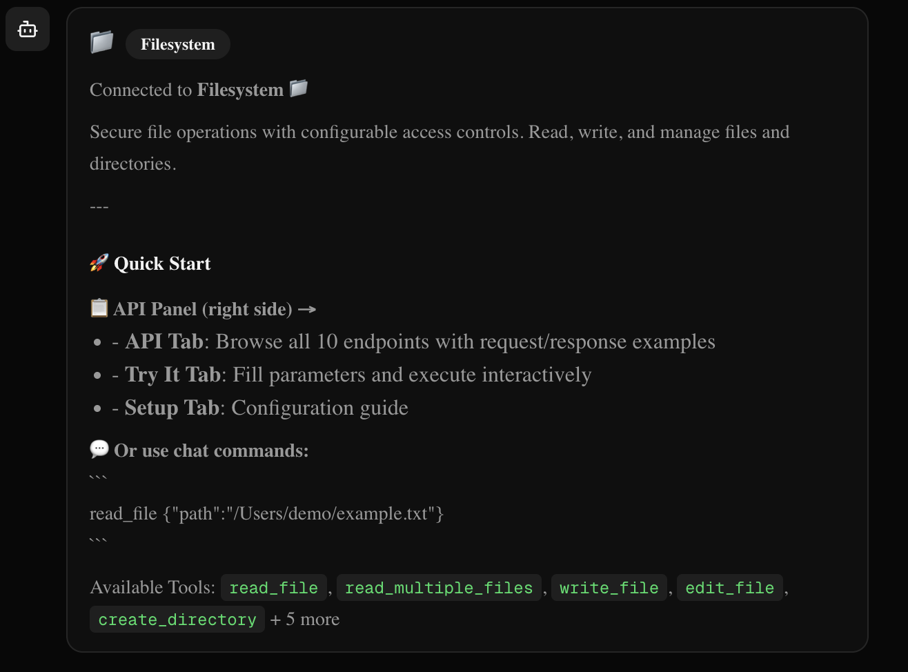
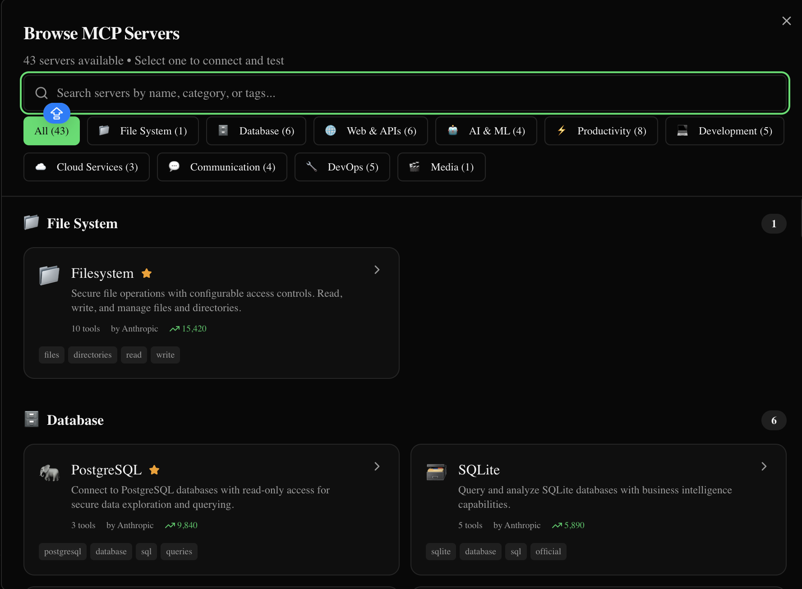

# MCPilot 🚀

**Swagger for MCP Servers** - A beautiful, interactive testing interface for Model Context Protocol (MCP) servers.

[](https://github.com/mithunsinghtocode/mcpilot)
[](https://nextjs.org/)
[](https://www.typescriptlang.org/)
[](https://app.netlify.com/start/deploy?repository=https://github.com/mithunsinghtocode/mcpilot)

## 📸 Screenshots

### Main Interface

*Chat interface with command palette and server browsing*

### API Documentation (Swagger-style)

*Interactive API documentation with request/response examples*

### Server Panel - Try It

*Test any MCP server tool with form or JSON input*

### Servers Modal

*Browse 40+ MCP servers by category*

---

## ✨ Features

- **🎯 40+ MCP Servers** - Pre-configured servers including Filesystem, GitHub, OpenAI, Slack, and more
- **📋 Swagger-like API Documentation** - Interactive endpoint documentation with request/response examples
- **🧪 Mock Mode** - Test any server instantly without configuration
- **⚡ Real Mode** - Execute actual operations with proper credentials
- **💬 Chat Interface** - Claude Code-style `/` commands for quick navigation
- **🎨 Modern UI** - Built with shadcn/ui components

## 🌐 Live Demo

[](https://app.netlify.com/start/deploy?repository=https://github.com/mithunsinghtocode/mcpilot)

> Click the button above to deploy your own instance to Netlify for free!

## 🚀 Quick Start

```bash
# Clone the repository
git clone https://github.com/mithunsinghtocode/mcpilot.git
cd mcpilot

# Install dependencies
npm install

# Start development server
npm run dev
```

Open [http://localhost:3000](http://localhost:3000) in your browser.

## 📖 Usage

### Chat Commands

| Command | Description |
|---------|-------------|
| `/servers` | Browse all available MCP servers |
| `/filesystem` | Connect to Filesystem server |
| `/github` | Connect to GitHub server |
| `/openai` | Connect to OpenAI server |
| `/hot` | Show trending/popular servers |
| `/help` | Show help message |
| `/clear` | Clear chat history |

### Executing Tools

**Via Chat:**
```
read_file {"path": "/Users/demo/test.txt"}
```

**Via API Panel:**
1. Select a server from the list or type `/servername`
2. Go to the **API** tab to see all endpoints with examples
3. Click **Try it** on any endpoint
4. Fill in parameters and click **Execute**

### Mock vs Real Mode

| Mode | Description | Setup Required |
|------|-------------|----------------|
| 🧪 **Mock** (default) | Returns realistic sample data instantly | None |
| ⚡ **Real** | Executes actual operations | API keys needed |

## 🔧 Configuration

For Real mode, create a `.env.local` file:

```env
# GitHub
GITHUB_TOKEN=ghp_xxxxx

# OpenAI
OPENAI_API_KEY=sk-xxxxx

# Anthropic
ANTHROPIC_API_KEY=sk-ant-xxxxx

# Slack
SLACK_BOT_TOKEN=xoxb-xxxxx

# Stripe
STRIPE_SECRET_KEY=sk_xxxxx

# And more...
```

## 🚀 Deployment

### Deploy to Netlify (Recommended - Free)

1. **One-Click Deploy:**
   
   [](https://app.netlify.com/start/deploy?repository=https://github.com/mithunsinghtocode/mcpilot)

2. **Via Netlify Dashboard:**
   - Go to [netlify.com](https://netlify.com) and sign up/login
   - Click "Add new site" → "Import an existing project"
   - Connect your GitHub and select `mcpilot` repository
   - Click "Deploy site"
   - Your app will be live at `https://your-site-name.netlify.app`

3. **Via Netlify CLI:**
   ```bash
   # Install Netlify CLI
   npm i -g netlify-cli
   
   # Login to Netlify
   netlify login
   
   # Deploy
   netlify deploy --prod
   ```

### Environment Variables (Netlify)

Add your API keys in Netlify Dashboard:
1. Go to Site Settings → Environment Variables
2. Add each key (e.g., `GITHUB_TOKEN`, `OPENAI_API_KEY`)
3. Trigger a new deploy for changes to take effect

### Other Free Platforms

| Platform | Support | Free Tier | Notes |
|----------|---------|-----------|-------|
| **Netlify** | ✅ Full | 100GB bandwidth/mo | Recommended |
| **Render** | ✅ Full | 750 hrs/mo | Good alternative |
| **Railway** | ✅ Full | $5 credit/mo | Easy setup |
| **Cloudflare Pages** | ✅ Full | Unlimited requests | Very fast CDN |

<details>
<summary>📦 Deploy to Render (Free)</summary>

1. Go to [render.com](https://render.com) and sign up
2. Click "New" → "Web Service"
3. Connect your GitHub repo
4. Configure:
   - **Build Command:** `npm install && npm run build`
   - **Start Command:** `npm start`
5. Click "Create Web Service"

</details>

<details>
<summary>📦 Deploy to Cloudflare Pages (Free)</summary>

1. Go to [pages.cloudflare.com](https://pages.cloudflare.com)
2. Click "Create a project" → "Connect to Git"
3. Select your repository
4. Configure:
   - **Build command:** `npm run build`
   - **Build output directory:** `.next`
5. Add environment variable: `NODE_VERSION` = `20`
6. Click "Save and Deploy"

</details>

<details>
<summary>📦 Docker Deployment</summary>

```dockerfile
FROM node:20-alpine AS builder
WORKDIR /app
COPY package*.json ./
RUN npm ci
COPY . .
RUN npm run build

FROM node:20-alpine AS runner
WORKDIR /app
ENV NODE_ENV production
COPY --from=builder /app/.next/standalone ./
COPY --from=builder /app/.next/static ./.next/static
COPY --from=builder /app/public ./public
EXPOSE 3000
CMD ["node", "server.js"]
```

```bash
docker build -t mcpilot .
docker run -p 3000:3000 mcpilot
```

</details>

## 📦 Supported MCP Servers

### Official (Anthropic)
- Filesystem, GitHub, PostgreSQL, SQLite
- Brave Search, Memory, Puppeteer
- Slack, Google Drive, Fetch, Time

### Community
- OpenAI, Anthropic, Discord, Stripe
- Docker, Kubernetes, AWS, Azure
- MongoDB, Redis, Elasticsearch
- Notion, Linear, Jira, Confluence
- And many more...

## 🛠️ Tech Stack

- **Framework**: Next.js 16 (App Router)
- **Language**: TypeScript
- **Styling**: Tailwind CSS
- **Components**: shadcn/ui
- **State**: Zustand
- **Commands**: cmdk

## 📁 Project Structure

```
mcpilot/
├── src/
│   ├── app/                 # Next.js app router
│   │   ├── api/mcp/        # MCP execution API
│   │   └── page.tsx        # Main chat interface
│   ├── components/
│   │   ├── chat/           # Chat components
│   │   └── ui/             # shadcn/ui components
│   └── lib/
│       ├── mcp-handlers/   # Real & mock handlers
│       └── mcp-servers.ts  # Server definitions
├── public/
│   └── screenshots/        # App screenshots
├── netlify.toml            # Netlify configuration
└── package.json
```

## 🤝 Contributing

Contributions are welcome! Please feel free to submit a Pull Request.

1. Fork the repository
2. Create your feature branch (`git checkout -b feature/amazing-feature`)
3. Commit your changes (`git commit -m 'Add amazing feature'`)
4. Push to the branch (`git push origin feature/amazing-feature`)
5. Open a Pull Request

## 📄 License

MIT License - see [LICENSE](LICENSE) for details.

## 🙏 Acknowledgments

- [Model Context Protocol](https://modelcontextprotocol.io/) by Anthropic
- [shadcn/ui](https://ui.shadcn.com/) for beautiful components
- [Postman MCP Collection](https://www.postman.com/explore/mcp-servers) for server references

---

<p align="center">
  Built with ❤️ for the MCP community
  <br><br>
  <a href="https://github.com/mithunsinghtocode/mcpilot">⭐ Star on GitHub</a> •
  <a href="https://github.com/mithunsinghtocode/mcpilot/issues">🐛 Report Bug</a> •
  <a href="https://github.com/mithunsinghtocode/mcpilot/issues">✨ Request Feature</a>
</p>
